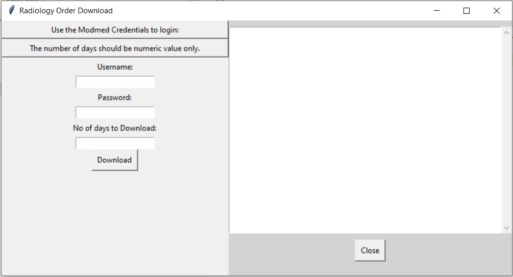

The app is designed to extract the data from the website using the login credential.
The data is used for analysis, feed the extracted data into the dashboard for daily governance.

The web scrapper is codded using beautiful soup and selenium libraries. 
The GUI application is created using the tikenter library which allows the user to login into the application
and extract the data.

The application also has a output display window which provides the status of complition of every steps.

